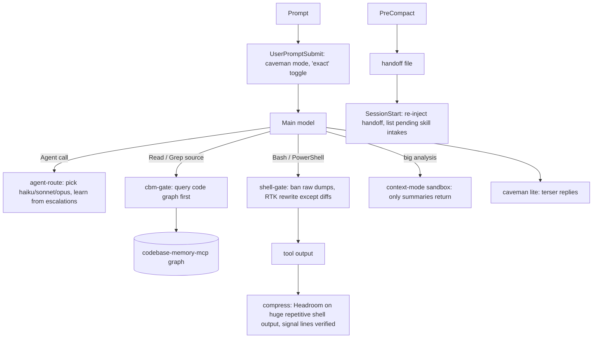

# claude-token-stack

A layered, **accuracy-guarded** token-efficiency setup for Claude Code on Windows — including Claude Code running inside the **Claude desktop app** (Code tab), where proxy-based tools don't work.

It combines five open-source tools with one custom hook dispatcher (`ts.js`) that enforces them, guards them against silent information loss, routes subagents to the right model, survives compaction with a handoff, and puts every new skill through an intake audit.

> Inspired by *"How I Cut Claude Code Token Usage by 90%+ With 5 Tools, Custom Hooks, and Enforcement"* (sgaabdu4/claude-code-tips, Apr 2026). This repo is a Windows/desktop-app port that was tested live, with several of that article's settings corrected and extra safeguards added where testing showed real accuracy loss. See [What's different from the article](#whats-different-from-the-article).

**Quick start:** [`BOOTSTRAP_PROMPT.md`](BOOTSTRAP_PROMPT.md) — paste one prompt into Claude Code and it installs, verifies and benchmarks everything with you. Or run `install.ps1` yourself ([docs/SETUP.md](docs/SETUP.md)).

---

## Architecture



| Layer | Tool | What it saves | Where |
|---|---|---|---|
| 1 | [codebase-memory-mcp](https://github.com/DeusData/codebase-memory-mcp) (`cbm`) | Code exploration: graph queries instead of reading files | MCP server + `cbm-gate` hook |
| 2 | [context-mode](https://github.com/mksglu/context-mode) | Large outputs/analysis stay in a sandbox; only summaries return | Plugin (MCP + hooks) |
| 3 | [RTK](https://github.com/rtk-ai/rtk) | Shell output compressed in place (`git status/log`, test runners…) | `shell-gate` hook rewrite |
| 4 | [Headroom](https://github.com/headroomlabs-ai/headroom) | Huge repetitive shell output folded, originals retrievable | `compress` hook + MCP server |
| 5 | [Caveman](https://github.com/JuliusBrussee/caveman) | Claude's own replies (lite mode) | Plugin |
| + | `ts.js` router | Subagent model selection (cost) with learned escalation | `agent-route` hook |
| + | `ts.js` handoff | State survives compaction | `precompact` + `session-start` hooks |
| + | `skill-intake` | New/changed skills audited for the stack | skill + hooks |

---

## Measured savings (real data, 2026-10-01)

All measurements on one Windows machine, Claude Code 2.1.280 in the desktop app, against a real ~5,100-file TypeScript/pnpm monorepo. Tokens ≈ characters ÷ 4. Reproduce on your own repo with [`tests/benchmark.js`](tests/benchmark.js) and [`tests/caveman-ab.js`](tests/caveman-ab.js).

### Per layer

| Layer | Scenario | Without | With | Saved | Source |
|---|---|---:|---:|---:|---|
| **cbm** | "Find method X, who calls it, show the code" — vs. grep + Read every matching file | 46,050 chars (4 files) | ~3,200 chars (3 graph calls) | **~93%** | live MCP calls |
| **context-mode** | Scan all 5,101 source files for a symbol and summarize | 76M chars if read | ~1.7K chars returned | **>99.9%** | live `ctx_execute` |
| **RTK** | `git status` / `git log -20` | 25 / 3,721 tok | 12 / 1,312 tok | **52% / 65%** | `benchmark.js` |
| **RTK** | Real usage across all sessions, first day (65 commands) | 47.9K tok | 42.0K tok | **12.2%** | `rtk gain` |
| **Headroom** (guarded) | Real sessions: 15 outputs over threshold | 78.8K chars (2 compressed) | 418 chars | 99% on the 2 that qualified; **3 rejected by safety guard**, 10 below threshold | `headroom-hook.jsonl` |
| **Headroom** (guarded) | `git log --stat -300`, `pnpm ls -r` | 59.5K / 5.4K tok | unchanged | 0% (guard declined: signal-dense or excluded) | `benchmark.js` |
| **Caveman lite** | Same 3 questions, Sonnet 5, A/B | 1,787 tok | 1,362 tok | **24%** (range −1% … 40%) | `caveman-ab.js` |
| **Model router** | Research subagent, 50K in / 5K out | Fable 5.1: $0.75 | Sonnet 5: $0.15 | **80% cost** | list prices |
| **Model router** | Audit subagent, same size | Fable 5.1: $0.75 | Opus 5.5: $0.30 | **60% cost** | list prices |

**Honest notes**
- context-mode's own `ctx_stats` reported "19.0M tokens / ~$95 saved" for that one scan. That counts all 72.5 MB scanned as if it would otherwise have been read — no one would do that. The fair comparison is the cbm row: what a grep-then-read approach would actually load.
- RTK's first-day 12% includes `git diff` calls, which this stack now **excludes** from RTK (see below), so steady-state RTK savings are lower on diff-heavy work and higher on log/status/test-runner-heavy work.
- Headroom, with guards on, rarely fires. That's intentional: it only folds output that is huge, repetitive and low-signal (build/install spam). Most of its value is preventing the occasional 80 KB log from eating the context window.

### Estimate for a typical coding session

Model, not measurement — adjust the mix for your work:

| Share of session tokens (assumed) | Category | Reduction applied | Net |
|---|---|---:|---:|
| 50% | Code exploration (file reads, greps) | 70% (cbm gate; some reads unavoidable) | −35% |
| 25% | Shell/tool output | 15% (RTK + Headroom, diffs exact) | −4% |
| 10% | Claude's replies | 24% (caveman lite) | −2% |
| 15% | System prompt, CLAUDE.md, tool schemas | ~0% | 0% |
| | **Total context tokens** | | **≈ 40% fewer (range 30–60%)** |

Plus **50–80% lower cost on delegated subagent work** from model routing, and fewer lost sessions from compaction handoffs.

This is below the article's 90%+ headline, deliberately: every place where testing showed compression could hide information (diffs, test failures, signal-dense logs, web pages) is excluded. Measure your own with `codeburn`, `rtk gain`, `ctx_stats`, `ts.js agent-report`.

---

## Accuracy safeguards

Found by testing, not assumed:

| Risk found | Evidence | Safeguard |
|---|---|---|
| Headroom dropped the one meaningful line of a 60-file `git diff` (and `HEADROOM_LOSSLESS=1` had no effect outside the proxy) | default-vs-lossless probe during build; now covered by `tests/compression.test.js` | Diffs/patches/source never compressed; every error/warn/fail/expected/received line must survive verbatim or the original is kept; >40 signal lines → never compressed; only shell output ≥15K chars; Headroom must leave a retrieval hash |
| `rtk git diff` hid 238 of 667 changed lines (36%) | `tests/benchmark.js` | Diffs, `git show`, patches, `git log -p/--stat`, file dumps never rewritten through RTK |
| Haiku miscounted a directory (15 vs 16) | live subagent run | Haiku only for trivially checkable transforms (rename/reformat/typo); counting/listing → Sonnet; high-stakes classes have an **Opus floor** |
| Graph missed a caller (method called from another module; graph said 0 callers) | live `trace_path` | `Grep` with `files_with_matches` is never gated; CLAUDE.md ripple rule: confirm with text search |
| Caveman/compression could hide caveats | — | Say **"exact"**, "full output" or "raw output" in a prompt → compression off until the next prompt; code/commits/security notes stay full prose |
| Global escape hatch let one session disable gates in all sessions | live: another session created `unlock-shell` | Per-session unlocks `unlock-<gate>-<session_id>`; global ones reserved for the user |

---

## What's different from the article

| Article | This repo | Why |
|---|---|---|
| `headroom wrap claude` proxy | Headroom **MCP server + PostToolUse hook** | The desktop app ignores `ANTHROPIC_BASE_URL`; proxying is CLI-only |
| MCP config in `claude_desktop_config.json` (common advice) | `~/.claude.json` user scope | The Code tab reads Claude Code's config, not the Chat tab's |
| `claude -p --bare` for handoffs | `claude -p` with `--settings {"disableAllHooks":true} --tools ""`, plus a deterministic fallback | `--bare` ignores subscription OAuth (API key only) |
| bash + jq hooks, `/tmp/$PPID` markers | One Node script, session-id scoped state | Works under PowerShell and Git Bash; no jq |
| Bash-only matchers | `Bash|PowerShell` matchers | Claude Code on Windows mostly uses the PowerShell tool |
| `cargo install rtk` (implied) | `winget install rtk-ai.rtk` | crates.io `rtk` is an unrelated crate |
| Subagents pinned to one model | Router with Opus floor + learned escalation | Cost where safe, strength where needed |
| statusLine | omitted | Not rendered in the desktop app |
| Compress everything | Guarded, opt-out per prompt | Accuracy (see above) |

---

## Repo layout

```
install.ps1                 idempotent Windows installer (backs up first)
BOOTSTRAP_PROMPT.md         one prompt to have Claude Code do the whole setup with you
settings.template.json      hooks/env/plugins merged non-destructively into ~/.claude/settings.json
scripts/merge-settings.js   the merger
hooks/tokenstack/ts.js      all custom hooks (one dispatcher)
hooks/tokenstack/hr_compress.py   Headroom bridge used by the compress hook
claude/CLAUDE.md            global rules (installed as CLAUDE.tokenstack.md + @import if you already have one)
claude/rules/stacks.md      per-stack skill gates (example rows)
claude/skills/skill-intake/ skill that audits new/changed skills
claude/commands/handoff.md  /handoff manual checkpoint
claude/skills/antigravity/  optional: delegate tasks to Antigravity (agy) and verify the result
hooks/tokenstack/agy-run.js optional: Antigravity runner (model routing, live progress, git snapshot)
hooks/tokenstack/agy/       optional: WSL side of the runner
tests/                      hooks / compression / router self-tests, benchmark, caveman A/B
docs/SETUP.md               every install step, manual equivalents, verification, uninstall
docs/CONFIGURATION.md       every option, threshold, file and escape hatch
docs/TROUBLESHOOTING.md     problems hit during the build and their fixes
docs/ANTIGRAVITY.md         Antigravity delegation: install, models, routing, verification, security
```

## Optional: Antigravity delegation

`.\install.ps1 -Antigravity` adds a skill that hands work to the Antigravity CLI (`agy`, running in WSL). Say "use antigravity", "use google", "have gemini pro review this" or "use antigravity with opus". Claude picks the model: Flash or Sonnet for bulk work, Pro or Opus for reasoning and reviews, and Opus for hard tasks, unless you name one. It runs the job as a background task with live progress, then checks the diff and runs your tests before it reports back. Ask "what models can antigravity use?" for the list. See [docs/ANTIGRAVITY.md](docs/ANTIGRAVITY.md).

## Security notes

- Install only from the official sources listed in [docs/SETUP.md](docs/SETUP.md). A Reddit thread warned about fake Headroom downloads; **extraheadroom.com** and **gglucass/headroom-desktop** are third-party and not used here.
- Telemetry is turned off through each tool's own switch (`HEADROOM_BEACON=off`, `CAVEMAN_TELEMETRY=0`).
- **Never set `DO_NOT_TRACK`, `DISABLE_TELEMETRY` or `CLAUDE_CODE_DISABLE_NONESSENTIAL_TRAFFIC`** in settings `env`, a shell profile or the system environment. They turn off Claude Code feature flags and break Remote Control.
- context-mode is licensed **ELv2** (Elastic License 2.0), not OSI open source — fine for personal use; check before redistributing.

## License

MIT for this repo's own files. Each upstream tool keeps its own license.
