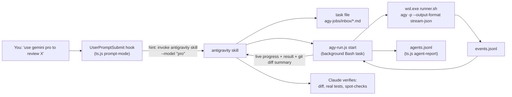

# Antigravity delegation (optional)

Say "use antigravity", "use google", "have gemini do X" or "use antigravity with opus" and Claude hands the task to the Antigravity CLI (`agy`). The job runs as a background task that you can watch in the task list. When it finishes, Claude checks the work before reporting back.

Install it with `.\install.ps1 -Antigravity` (WSL distro defaults to `Ubuntu`; override it with `-WslDistro <name>`).

## How it fits together



- **Trigger:** the `prompt-mode` hook detects delegation phrases. It adds a one-line hint naming the skill and the model spec you typed. A phrase that only mentions a Google product (for example "use the Google Docs API") also matches. The skill's description makes Claude confirm that you meant delegation.
- **Skill** (`~/.claude/skills/antigravity/SKILL.md`): picks the model, writes a self-contained task file, starts the runner in the background, and verifies the result.
- **Runner** (`~/.claude/hooks/tokenstack/agy-run.js`): resolves the model, snapshots git, starts `agy` in WSL, and turns stream-json into readable progress lines. At the end it prints the result, token usage and the git changes since the snapshot. It also logs the job to the subagent router.
- **WSL side** (`agy/runner.sh`): runs `agy -p` with a hard `timeout`, with stdin closed and output in `events.jsonl`.

## Why WSL

Native Windows `agy -p` hangs in print mode (upstream issue #6 in `yuting0624/antigravity-for-claude-code`). Inside WSL it works. Windows paths are converted to `/mnt/c/...`. The prompt tells agy to run Windows toolchains through `cmd.exe /c "..." < /dev/null` instead of installing Linux ones. Without `< /dev/null`, Windows commands started from WSL wait about 30 s on stdin.

The upstream plugin (`yuting0624/antigravity-for-claude-code` v0.28.0) was reviewed, but its Claude hooks are not enabled. They inject a policy at every session start and a nudge on every prompt, which costs tokens and duplicates this stack's router. Its knowledge is reused in the skill and runner instead.

## Models

`node ~/.claude/hooks/tokenstack/agy-run.js models` lists what your account can use (cached 24 h) and the auto-routing table. Typical list: Gemini Flash 3.6–3.8 (low/medium/high), Gemini 3.1 Pro (low/high), Claude Opus and Sonnet (low/medium/high), GPT-OSS 120B.

You can name a model loosely. The runner fuzzy-matches the name against the live list. Effort defaults to `high` and version defaults to the newest.

| You say | Resolves to |
|---|---|
| `opus` | `claude-opus-*-high` (newest) |
| `sonnet medium` | `claude-sonnet-*-medium` |
| `flash`, `flash 3.7`, `flash 3.6 low` | `gemini-<v>-flash-<effort>` |
| `pro`, `gemini pro` | `gemini-*-pro-high` |
| an exact id | that id |

### Auto-routing (no model named)

The task text is classified with the same router classes as subagents. The family comes from your words: "google"/"gemini" means `google`, "claude" means `claude`, and plain "antigravity" means `any`.

| Class | google | claude | any |
|---|---|---|---|
| hard (`hardPattern`: hard, complex, from scratch, redesign, …) | pro | opus | opus |
| deep (review, audit, architecture, root-cause, …) | pro | opus | pro |
| build (implement, fix, test) | flash | sonnet | flash |
| research | flash | sonnet | flash |
| mechanical (rename, reformat) | flash-lo | sonnet | flash-lo |
| other | flash | sonnet | flash |

Edit the `antigravity` section of `~/.claude/tokenstack/model-routing.json` to change the routing table, aliases, `hardPattern`, `distro` or `defaultTimeout`. Delete the section to regenerate the defaults.

Preview a decision without running anything:

```bash
node ~/.claude/hooks/tokenstack/agy-run.js resolve --task "review the auth diff" --family google
```

## Runner commands

| Command | Purpose |
|---|---|
| `start --task-file F [--dir D] [--model S \| --family google\|claude] [--timeout 30m] [--add-dir P] [--no-yolo]` | Run a job in the foreground and stream progress (the skill runs it as a background task). |
| `models [--refresh]` | List the models and the routing table. |
| `resolve --task T [--model S] [--family F]` | Show which model would be used and why. |
| `list` | Recent jobs. |
| `status <job-id>` | One-line progress. |
| `result <job-id>` | Print the final result again. |
| `cancel <job-id>` | Kill the WSL process tree. |
| `doctor` | Check WSL, agy, sign-in, models and the runner. |

Jobs live in `~/.claude/tokenstack/agy-jobs/<id>/` (`prompt.txt`, `job.env`, `job.json`, `events.jsonl`, `stderr.log`, `exit`).

## Verification (always done by Claude)

1. A status other than `SUCCESS` means Claude reports the reason and offers a re-run.
2. For code changes, Claude reads the diff against the pre-run snapshot. Then it runs the project's real tests, typecheck and lint itself. It checks for weakened tests, scope creep and commits (agy is told not to commit).
3. For research answers, Claude spot-checks 2–3 concrete claims.
4. If problems remain, Claude fixes small ones itself or re-delegates one tier up (flash, then pro, then opus).

## Security

- **Auto-approve** (the default, `--dangerously-skip-permissions`) lets agy run any command that WSL can run. That includes everything under `/mnt/c`. Use `--no-yolo` (say "cautious run") for untrusted tasks. Prefer clean working trees.
- The installer downloads only `https://antigravity.google/cli/install.sh`, prints its SHA-256 and asks before running it. The script installs a sha512-verified binary into `~/.local/bin` without sudo.
- Sign-in is interactive and stays with you: `wsl -d Ubuntu --cd ~ -- bash -lc agy`.

## Limits

- Projects on mapped network drives (for example `Z:`) need a one-time WSL mount: `sudo mkdir -p /mnt/z && sudo mount -t drvfs Z: /mnt/z`. The runner exits with code 16 if it can't reach the directory.
- Token usage reported by agy counts against your Antigravity quota, not Claude's. It shows up in `ts.js agent-report` as `agy/<tier>/<model>`.
- Sessions that were already open need a restart to pick up the skill and the CLAUDE.md line. The hook applies immediately.
